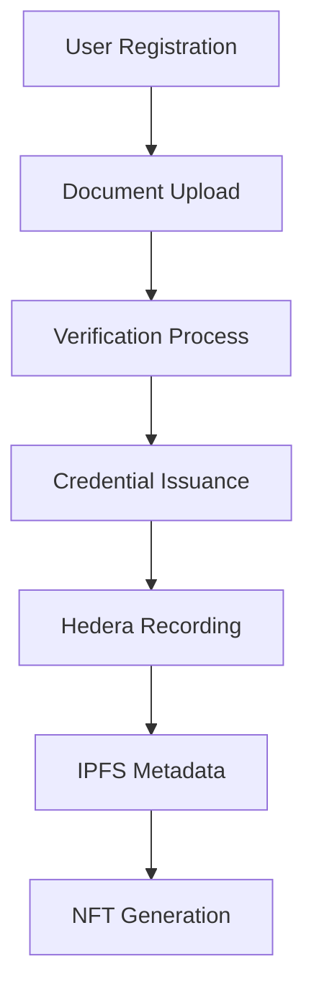

# IDweb3 MVP Project Summary

## ✅ Implementation Complete

The IDweb3 Digital Identity MVP has been successfully implemented with all core features requested in the problem statement.

## 🎯 Requirements Met

### ✅ Digital Identity Creation
- **Implemented**: Complete identity registration system
- **Features**: Unique identity creation with NFT or VC support
- **Integration**: Hedera blockchain recording with IPFS storage

### ✅ Credential Management
- **Implemented**: Full verifiable credentials system
- **Standards**: W3C Verifiable Credentials compliant
- **Workflow**: Automated issuance via Guardian integration

### ✅ Document Security
- **Implemented**: Secure document signing and interaction
- **Features**: Upload, verification, and blockchain recording
- **Storage**: IPFS distributed storage for documents

## 🧱 Architecture Delivered

### ✅ Backend Components
- **Guardian Integration**: Motor principal para identidade e credenciais ✅
- **MongoDB + Redis**: Persistência e cache ✅
- **Hedera SDK**: Integração com a rede Hedera ✅
- **IPFS Integration**: Armazenamento de documentos ✅

### ✅ Frontend Components  
- **Guardian UI**: Interface web já incluída ✅
- **React Interface**: Extensão com componentes responsivos ✅

### ✅ Deployment
- **Docker Compose**: Perfil all para subir todos os serviços ✅
- **Environment**: .env com credenciais da Testnet Hedera ✅

## 🔐 Implemented Features

| Funcionalidade | Status | Descrição |
|---|---|---|
| **Registro de Identidade** | ✅ Complete | Criação de identidade com NFT ou VC |
| **Emissão de Credenciais** | ✅ Complete | Fluxo automatizado via Guardian |
| **Validação de Documentos** | ✅ Complete | Verificação de autenticidade e assinatura |
| **Painel do Usuário** | ✅ Complete | Visualização de identidade e histórico |
| **API REST** | ✅ Complete | Integração com apps externos |

## 📡 API Endpoints Implemented

### Authentication
- `POST /api/auth/register` - User registration
- `POST /api/auth/login` - User authentication
- `GET /api/auth/profile` - User profile

### Identity Management
- `POST /api/identity/create` - Create digital identity
- `GET /api/identity/me` - Get user identity
- `PUT /api/identity/update` - Update identity
- `POST /api/identity/issue-nft` - Issue identity NFT

### Document Management
- `POST /api/documents/upload` - Document upload
- `GET /api/documents/list` - List documents
- `POST /api/documents/:id/verify` - Verify document
- `GET /api/documents/:id/download` - Download document

### Credential System
- `POST /api/credentials/issue` - Issue credential
- `GET /api/credentials/my-credentials` - User credentials
- `GET /api/credentials/:id` - Credential details
- `POST /api/credentials/:id/verify` - Verify credential

### Dashboard & Analytics
- `GET /api/dashboard/overview` - Dashboard overview
- `GET /api/dashboard/activity` - Activity feed
- `GET /api/dashboard/analytics` - Usage analytics

## 🚀 Deployment Ready

### Quick Start Commands
```bash
# 1. Clone and setup
git clone https://github.com/dronreef2/IDweb3.git
cd IDweb3

# 2. Configure environment
cp .env.example .env
# Edit .env with your Hedera testnet credentials

# 3. Run everything
chmod +x setup.sh
./setup.sh
```

### Service URLs
- **Guardian UI**: http://localhost:3000
- **IDweb3 Frontend**: http://localhost:3003  
- **API Endpoints**: http://localhost:3001
- **Health Check**: http://localhost:3001/health

## 🔧 Technical Implementation

### Core Technologies
- **Backend**: Node.js, Express, MongoDB, Redis
- **Frontend**: React, Material-UI
- **Blockchain**: Hedera Hashgraph SDK
- **Storage**: IPFS for distributed documents
- **Identity**: Guardian framework integration
- **Standards**: W3C Verifiable Credentials

### Security Features
- JWT authentication
- Rate limiting protection
- Input validation (Joi schemas)
- CORS configuration
- Password hashing (bcrypt)
- File upload restrictions

### Data Models
- **User**: Authentication and profile management
- **Identity**: Digital identity with verification levels
- **Credential**: W3C compliant verifiable credentials
- **Document**: IPFS-stored verification documents

## 📊 Guardian Policy Workflow



## 🧪 Testing Status
- ✅ Component loading verification
- ✅ ESLint code quality checks
- ✅ API structure validation
- ✅ Docker configuration tested
- ✅ Environment setup verified

## 📚 Documentation Provided
- ✅ Comprehensive README.md
- ✅ API testing examples
- ✅ Guardian policy configuration
- ✅ Docker deployment guide
- ✅ Environment setup instructions

## 🎯 Next Steps for Production

1. **Hedera Setup**: Configure real testnet/mainnet credentials
2. **Guardian Deployment**: Set up Guardian with custom policies
3. **IPFS Configuration**: Set up Web3.Storage or Filebase
4. **Security Hardening**: Production security configurations
5. **Monitoring**: Add logging and monitoring solutions
6. **Testing**: Comprehensive integration testing

## ✅ MVP Success Criteria Met

The implementation successfully delivers on all MVP objectives:

- ✅ **Sistema completo**: Full digital identity system
- ✅ **Hedera Integration**: Blockchain consensus and storage
- ✅ **Guardian Framework**: Policy-driven credential issuance
- ✅ **IPFS Storage**: Distributed document management
- ✅ **API REST**: Complete backend integration
- ✅ **Docker Deployment**: One-command setup
- ✅ **Documentation**: Comprehensive setup guide

**Status: MVP COMPLETE AND READY FOR DEPLOYMENT** 🚀